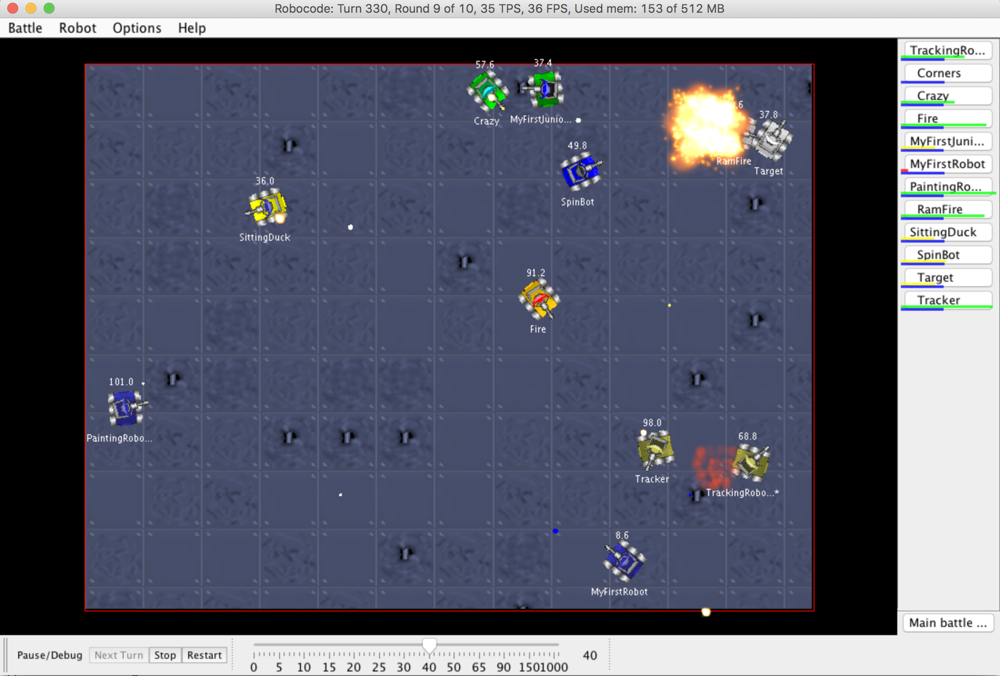
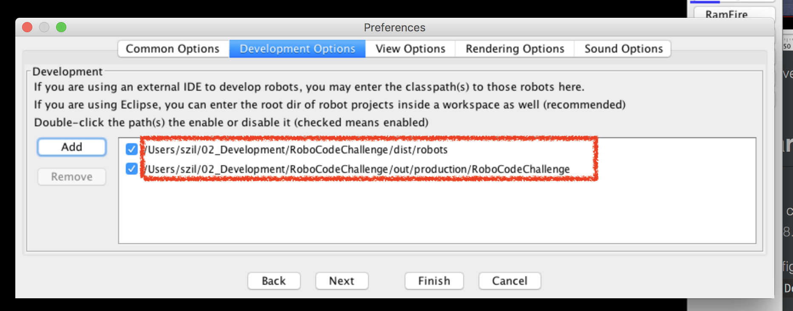
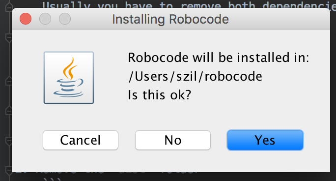
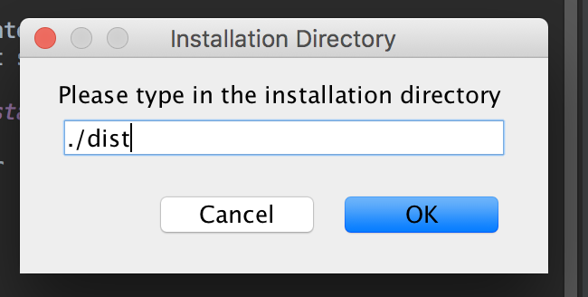

# The Robocode Challenge



The goal of this repository is to have a very fast setup for a RoboCode hacking challenge in Intellij.

## Steps required to start

1. Check out the repository
1. Make sure, that the Project SDK is configured correctly:
    > The code was tested with Java 8.
1. Start "Robocode" from the run configurations.
1. Go to `Options > Preferences > Development Options`
    
    Here please make sure that you selected the right folders.
    Usually you have to remove both dependencies and then re-add them to the following relative project paths:
    
    ```
    ./dist/robots
    ./out/production/RoboCodeChallenge
    ```
1. Restart Robocode from IntelliJ
1. You are now ready to get started!

## Further links and documentation
- Official side with further Reading [https://robocode.sourceforge.io](https://robocode.sourceforge.io)
- Documentation [https://robocode.sourceforge.io/docs/robocode/](https://robocode.sourceforge.io/docs/robocode/)

## More extended way of installation

1. Remove the `dist` folder
    ```
    rm -rf ./dist
    ```
2. Run the setup script:
   ```
    java -jar setup/robocode-1.9.3.3-setup.jar 
    ```
3. Specify the output folder relative to this project to `./dist` 

 
